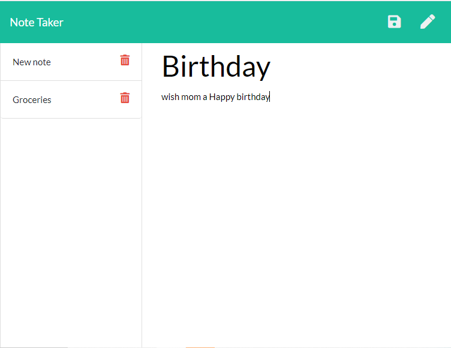

# Note Taker

## Table of Contents

* [Description](#description)
* [Installation](#installation)
* [Usage](#usage)
* [Contribution Guidelines](#contribution-guidelines)
* [License](#license)
* [Questions](#questions)
    
## Description
A personal note taker that saves notes input by the user and displays them. Notes are saved via express.js server

[Deployed Link](https://note-taker-burtk33.herokuapp.com/)

## Installation Instructions
Requires Node.js and node package modules 'inquirer', 'fs', 'path', 'uniqid' and 'express'

## Usage
Used as a personal note taker with server side functionality that saves the notes to a server

## Contribution Guidelines
No contributions permitted

## License
*This project uses the MIT license.*

*Read more about it by clicking the link below*

[License Link](https://choosealicense.com/licenses/mit/)

## Questions
[Github Profile](https://github.com/burtk33)

I can be reached via email at burtk33@gmail.com
